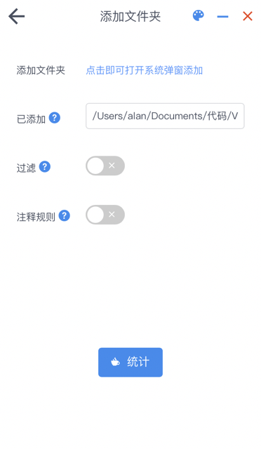

# Code Counter

> An application to count code in wails(golang)

> version:  2.0.0

> Author:  Alan Chen

> Technology stack:  Vue2 + Vite + iview + Golang + Wails v2

### Features
 * 采用wails v2包生成app、exe可执行文件，方便离线使用。
 * wails使用系统自带webview，而不是electron内置，软件打包后安装包2～3M，比内置chromium方案磁盘占用、内存占用率优秀很多
 * golang的go routine在读取文件和cpu计算会充分利用多核处理器，处理速度更快
 * 支持文件夹读取文件，自定义统计哪个文件夹下代码数量
 * 支持文件(夹)过滤，支持对应后缀名文件过滤
 * 支持对应后缀名文件添加自定义注释规则，目前只自带很小一部分代码的默认注释规则





### Usage Help
 1. 点击即可读取文件夹，目前仅支持统计一个文件夹，再次添加会覆盖
 2. 过滤功能只对文件夹生效，在弹窗中按enter添加，注意添加后缀名必须带上点
 3. 注释规则文件名不需要带点，规则分为多行注释和单行注释，非必填，一个后缀名文件可以添加多个规则，但不可重复。
 4. 软件默认过滤`node_modules`和`.git`两个文件夹。
 5. 软件默认提供js、ts、go、jsx、tsx、vue、svelte、html、css、java、vue、c和cpp等后缀名文件的注释规则
 6. 读取代码的原理其实是将目标文件的buffer转换成utf-8的string，所以只支持uft-8编码的文件，。大多数code的编码格式是utf-8。

### Download
> 见[release](https://github.com/alanchenchen/CodeCounter/releases)
 
### Directory Tree
``` bash
    ├─build                 编译平台相关的配置文件、可执行程序
    ├─count                 code counter的主要go module
    ├─frontend              wails展示的前端静态资源，wails不强关联前端框架和构建工具
    │  ├─src
    │  ├─wailsjs            wails在加载静态资源时自动生成的方法bindings，见wails文档
    │  ├─index.html
    │  ├─package.json
    │  └─vite.config.js     vite config配置
    ├─screenshot  
    ├─scripts               wails的常用命令组合的shell脚本，见wails文档
    ├─app.go                wails程序的app结构体，主要用于绑定go方法到js运行时，见wails文档
    ├─main.go               wails程序的入口，初始化，见wails文档
    └─wails.json            wails cli打包程序需要的配置，见wails文档
```

### Development Setup
#### Required dependencies
- Go 1.17+
- wails v2 beta+
- NPM (Node 15+)
> 详细见[wails文档](https://wails.io/zh-Hans/docs/gettingstarted/installation)

#### Dev liveload
项目逻辑分为前端和后端
- 前端可以使用任意框架，兼容性不用过于考虑，因为windows平台使用的webview2(和chromium一致)，前端使用go绑定方法也十分简单，都是挂载windows对象
- 后端的go方法可以使用任意go module，当需要绑定给js运行时，只需要在`app.go`里扩展App struct的接收器方法即可
- 如果需要在程序运行中使用前端项目的hot load热更新，必须要先打开一个终端运行`wails dev`，然后另一个终端运行`npm run dev`
- wails读取前端静态资源的策略比较奇怪，所以不建议使用wails的frontend构建

#### Build
- target是mac平台
    - 本机必须是mac系统，可以同时编译amd64、arm64架构
- target是windows平台
    - 只能编译windows，可以同时编译amd64、arm64架构

- 所有平台均可使用upx来压缩，压缩比例非常强
- mac平台编译完的是app文件，windows默认编译完的是exe，所有平台均可使用nsis来打包exe
- wails使用的方案是系统自带的webview，目前macos/linux主流版本均内置，windows平台使用的webview2只在部分win10和正式win11内置，所以当你的windwos系统中不存在webview2时，程序启动后会引导你安装，大概118M左右
